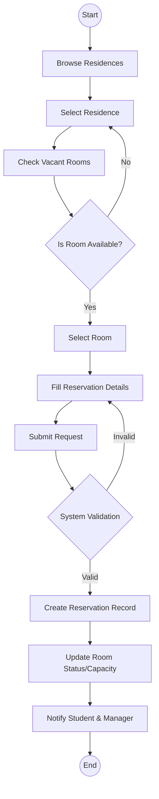
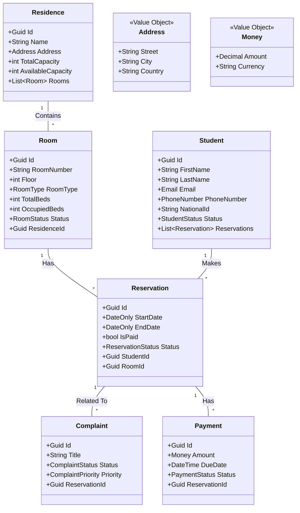
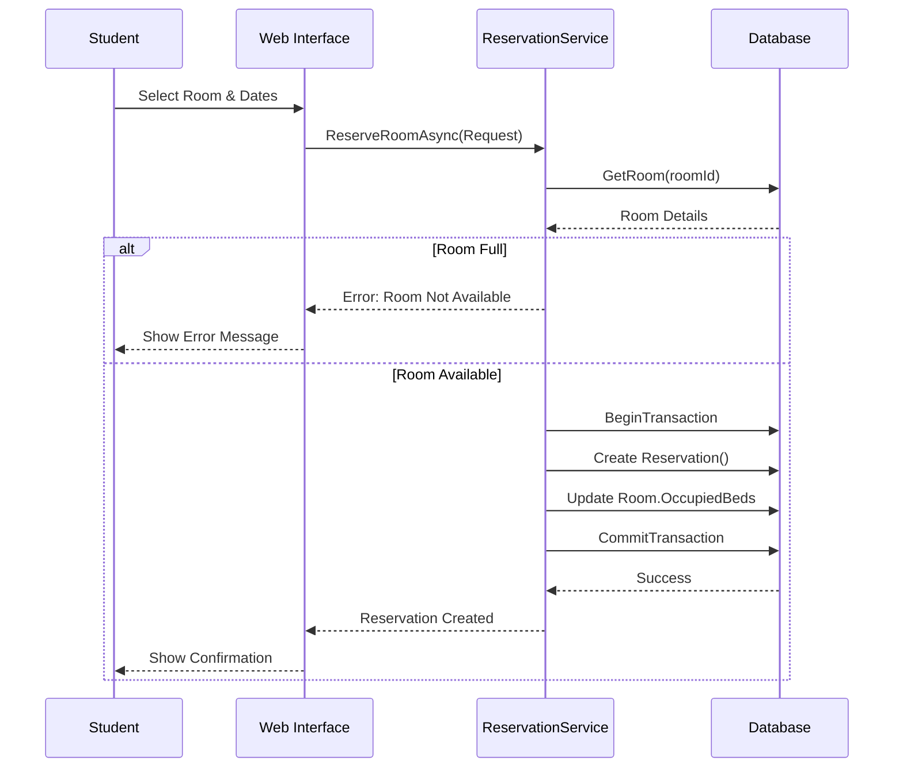
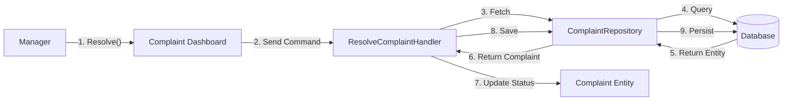
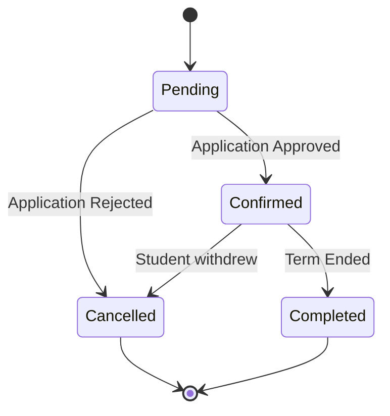
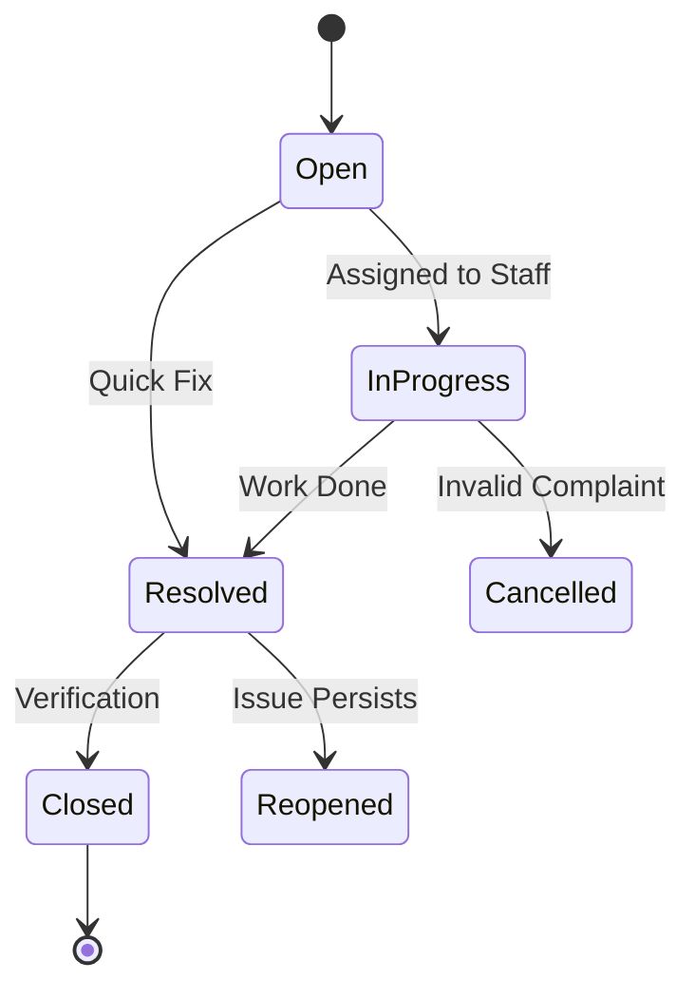

# Student Residence Management System (SRMS) - System Design Document

This document outlines the architecture, design, and diagrams extracted from the codebase of the Student Residence Management System.

## 1. System Architecture Design (Clean Architecture)

The system follows the **Clean Architecture** principles, separating concerns into distinct layers to ensure maintainability, testability, and independence from frameworks.

### Layers:
1.  **Domain Layer (`SRMS.Domain`)**:
    *   The core of the system containing Enterprise Logic.
    *   **Components**: Entities (`Student`, `Residence`, `Room`, `Reservation`, `Complaint`, etc.), Value Objects (`Address`, `Money`, `Email`), Enums, and Repository Interfaces (Abstractions).
    *   **Dependencies**: None. It is independent of other layers.

2.  **Application Layer (`SRMS.Application`)**:
    *   Contains Application Logic and Use Cases.
    *   **Patterns**: CQRS (Command Query Responsibility Segregation) using MediatR for some features (e.g., Students, Complaints) and Service Pattern for others (e.g., Reservations).
    *   **Components**: DTOs, Commands, Queries, Validators, and Service Interfaces (`IReservationService`).
    *   **Dependencies**: Depends on Domain Layer.

3.  **Infrastructure Layer (`SRMS.Infrastructure`)**:
    *   Implements interfaces defined in Application and Domain layers.
    *   **Components**: Database Context (`ApplicationDbContext` with EF Core), Repositories, Identity Services, File Storage, and External Services.
    *   **Dependencies**: Depends on Application and Domain Layers.

4.  **Presentation/WebUI Layer (`SRMS.WebUI.Server`)**:
    *   The entry point of the application.
    *   **Technology**: Blazor Server.
    *   **Components**: Pages, Components, Controllers (for API integration), and View Models.
    *   **Dependencies**: Depends on Application and Infrastructure Layers (via DI).

---

## 2. Use Case Descriptions

### Actors
*   **Student**: A resident or prospective resident.
*   **Manager (Registrar/Admin)**: Staff responsible for managing residences and requests.
*   **System**: Automated background processes.

### Core Use Cases

#### Student Module
*   **Register/Login**: Students create accounts and authenticate.
*   **Manage Profile**: Update personal details, contact info, and upload documents (National ID, etc.).
*   **View Residences**: Browse available residences and view details (amenities, location).
*   **Search Rooms**: Check vacant rooms in a specific residence.
*   **Book Room**: Create a reservation request for a specific room.
*   **My Reservations**: View current and past reservation history.

#### Complaint Module
*   **Raise Complaint**: Submit a issue regarding maintenance, noise, etc.
*   **Track Complaint**: View status updates on submitted complaints.

#### Manager Module
*   **Manage Residences/Rooms**: specific CRUD operations on buildings and rooms.
*   **Manage Students**: Verify identities, update statuses.
*   **Handle Complaints**: Assign, resolve, or reject complaints.
*   **View Dashboard**: Monitor occupancy, critical complaints, and income.

---

## 3. Use Case Diagram

```mermaid
usecaseDiagram
    actor "Student" as S
    actor "Manager" as M

    package "Reservation System" {
        usecase "Browse Residences" as UC1
        usecase "Check Room Availability" as UC2
        usecase "Make Reservation" as UC3
        usecase "Cancel Reservation" as UC4
    }

    package "Complaint System" {
        usecase "Submit Complaint" as UC5
        usecase "Track Status" as UC6
        usecase "Resolve Complaint" as UC7
    }

    package "Account Management" {
        usecase "Register/Login" as UC8
        usecase "Update Profile" as UC9
        usecase "Verify Student" as UC10
    }

    S --> UC1
    S --> UC2
    S --> UC3
    S --> UC4
    S --> UC5
    S --> UC6
    S --> UC8
    S --> UC9

    M --> UC7
    M --> UC10
    M --> UC1
    M --> UC2
```

---

## 4. Activity Diagrams

### Activity: Room Reservation Process



---

## 5. Class Diagram



---

## 6. Database Design

The database is designed using **Relational Model** (SQL Server), managed via Entity Framework Core.

### Key Tables & Schema
1.  **Students**
    *   `Id` (PK, Guid)
    *   `FirstName`, `LastName`, `Email`, `PhoneNumber`
    *   `CollegeId` (FK)
    *   `Status` (Enum: Active, Suspended, etc.)
    *   *Discriminator* (if using TPH inheritance, though `Entity` base suggests simple table per class or TPC).

2.  **Residences**
    *   `Id` (PK, Guid)
    *   `Name`, `Address_Street`, `Address_City` (Owned Type)
    *   `TotalCapacity`, `AvailableCapacity`

3.  **Rooms**
    *   `Id` (PK, Guid)
    *   `ResidenceId` (FK)
    *   `RoomNumber`, `Floor`, `RoomType`
    *   `TotalBeds`, `OccupiedBeds`

4.  **Reservations**
    *   `Id` (PK, Guid)
    *   `StudentId` (FK), `RoomId` (FK)
    *   `StartDate`, `EndDate`
    *   `Status` (FK or Enum)

5.  **AuditLogs**
    *   Tracks all changes (`Added`, `Modified`, `Deleted`) for security and history.

### Relationships (ERD)
*   **One-to-Many**: Residence -> Rooms
*   **One-to-Many**: Room -> Reservations
*   **One-to-Many**: Student -> Reservations
*   **One-to-Many**: Reservation -> Complaints
*   **One-to-Many**: Reservation -> Payments

---

## 7. Sequence Diagram

### Scenario: Create Reservation



---

## 8. Communication Diagram

### Scenario: Complaint Resolution by Manager



---

## 9. State Diagrams

### Reservation Status Lifecycle



### Complaint Status Lifecycle


